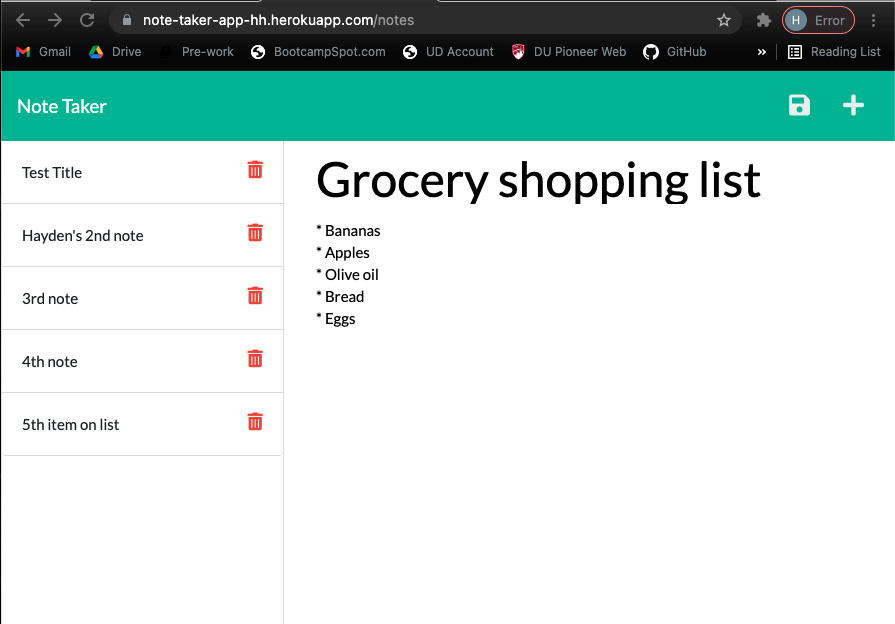

# NOTE TAKING APP

LIVE URL: https://note-taker-app-hh.herokuapp.com/

REPOSITORY: https://github.com/Hayden-Haun/Note-Taker

## Table of Contents

- [Description](#description)
- [Installation](#installation)
- [Contributions](#contributions)
- [Usage](#usage)
- [Tests](#tests)
- [Technologies Used](#Technologies)
- [Credits](#credits)
- [Questions](#questions)

## Description

    This application is a note taking tool that uses Express.js and Heroku to function. The user has the option to create & delete as many notes as they want, which will be saved on a server. The code uses modular API/HTML routing, query parameters, CRUD operations, body parsing, and data persistence techniques with Javascript.

## Installation

    npm i

## Contributions

    Contact the owner

## Usage

    node server.js

## Tests

    none

## Technologies Used

    Express.js, Node Package Managers, Javascript, Object Oriented Programming, Node.JS, Bootstrap, HTML, CSS

## Credits

    Hayden Haun

## Questions

    For additional questions, please contact GitHub user Hayden-Haun at haydenhaun@gmail.com
